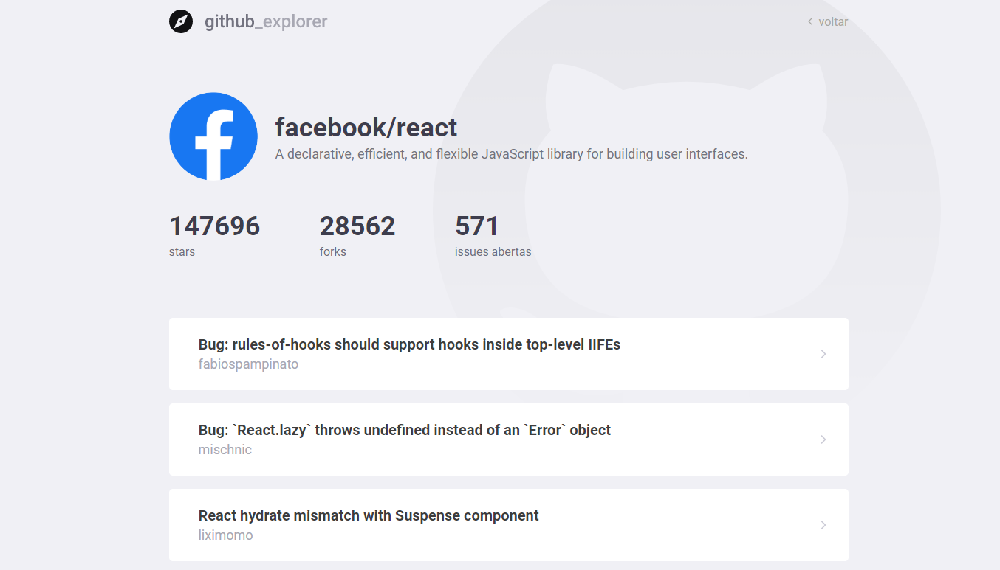

<p align="center">
  
</p>

# Sobre o projeto

Projeto desenvolvido para uma simples e prática maneira de listar repositórios do github. Basta pesquisar pelo nome do usuário/repositório na barra de pesquisa para encontrar os resultados.

Cada resultado pode ser visualizado com mais detalhes, tais como forks, issues ou stars.

<div style="display: flex">


</div>

## Construído com:

- [React.js](https://pt-br.reactjs.org/) - Framework front-end

- [Typescript](https://www.typescriptlang.org/) - linguagem utilizada

- [styled-components](https://styled-components.com/) para estilização dos componentes

- [react-router](https://github.com/ReactTraining/react-router) para roteamento das páginas

- [prettier](https://prettier.io/), [eslint](https://eslint.org/) e [editorconfig](https://editorconfig.org/) para padronização do projeto

### Pré-requisitos

Para execução do projeto, é necessária a instalação do [Node](https://nodejs.org/en/) versão LTS em sua máquina.

### Instalação

Antes de executar o projeto, é necessário instalar todas as dependências executando:

```
yarn install
```

Executando o projeto:

```
yarn start
```

✔ Após executar o comando, poderá visualizá-lo em http://localhost:3000 em seu navegador.

## Créditos

- **Diego Fernandes** - _Bootcamp Gostack 11_ - [RocketSeat](https://github.com/Rocketseat)
